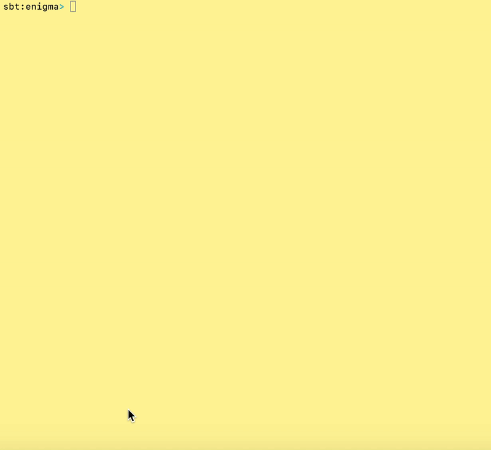

# Enigma

Pure functional paradigm implementation of the M3 [Enigma](https://en.wikipedia.org/wiki/Enigma_machine) Machine ...

  

  

## References

- Tim Perrett has a stylish functional implementation of Enigma using Scalaz Lenses (here)[https://github.com/timperrett/enigma].
- A useful Enigma (simulator)[https://www.101computing.net/enigma-machine-emulator/].
